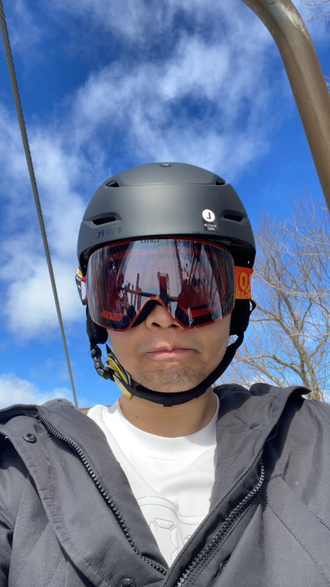

My research interests are low dimensional topology. In particular, my works find new differences between the smooth world and the continuous world in dimension 4. My advisor is Danny Ruberman. 

[Research statement](./research_statement.pdf) 

### Math Project

[Surgery formulas for Seiberg-Witten invariants and family Seiberg-Witten invariants](./surgery.pdf)

[Notes for Contact Geometry (In progress)](./contact.pdf)

-I'm very interested in knot theory, thus I try to learn contact geometry. I think details of a definition are important, since they may show some implicit ideas of the new structures. This note is mainly based on the lecture notes of Prof. Ko Honda and Pro. John B. Etnyre.

[ORBIT BRAID ACTION ON A FINITE GENERATED GROUP](./ORBIT_BRAID_ACTION_ON_A_FINITE_GENERATED_GROUP.pdf)

-This paper aims to generalize Artin’s ideas to establish an one-to-one correspondence between the orbit braid group and a quotient of a group formed by some particular G-homeomorphisms of a punctured plane, to compute orbit link group.

### Java Project

[cube-solver](https://github.com/hcqiu/cube-solver)

A Java project to solve Rubik's cube, built in LeJOS and implemented by a robot constructed from LEGO NXT.

<iframe width="560" height="315" src="https://www.youtube.com/embed/dAfDIDdDclc" frameborder="0" allow="accelerometer; autoplay; encrypted-media; gyroscope; picture-in-picture" allowfullscreen></iframe>

### Blockchain Project

[用可关联环签名设计半固定账号匿名社交平台](./用可关联环签名设计半固定账号匿名社交平台.pdf)

[Homepage as undergrad student](./undergrad.md)
